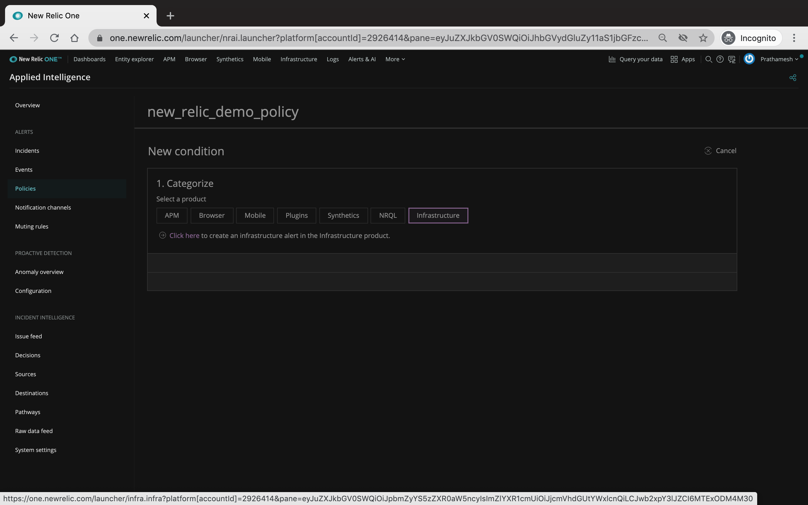

# NewRelic Alerts

> Make sure the ec2 machine assigned to you  has been NR infrastructe agent setup, we will create alerts on the same.

#### Creating a Alert Policy
1. Click on Alerts and AI from the top menu


2. Click on policy on the left and if you do not have any policy listed, create your very first alert policy


3. Start with creating the policy by Giving it a name of your liking


Next select the __By_condition__ Incident preference, and click on create alert policy


4. Once you created the alert policy, its time to create a condition. We will be creating a condition against our infrastructure monitoring




Select the host metric condition and give a suitable name. We would be setting up CPU utilization threshold


Set the Condition config as per your desire and hit create condition


5. Once you have your condition setup, its time to overwhelm our server CPU
Log-in to the EC2 instance if you have logged out.
>EC2 Login steps: 
>1. Ask for the ssh_key file if you do not already have one.
>2. Change the permission of the file that to `chmod 400 <file_name>`
>3. Once you have the file, ssh from your terminal using the following command:
>```
>ssh -i <ssh_key_file.pem> ec2-user@<node_public_ip or fqdn>
>```
To overwhelm the server, run an infinite loop:
```
while true; do echo 'hi'; done
```
Once you've initiated the execution, you CPU shall get overwhelmed in sometime


6. Once you see the CPU being used above it's threshold, come to the alert page and click on the incident on the left hand side


Click on the incident and you should see the incident is open and all the other details related to the infrastructure, take a look at what interests you


If you've demonstrated this, stop the script running on your ec2 instance and wait for sometime, check back the incident page you should see the incident has closed!


And thus concludes the Alert creation