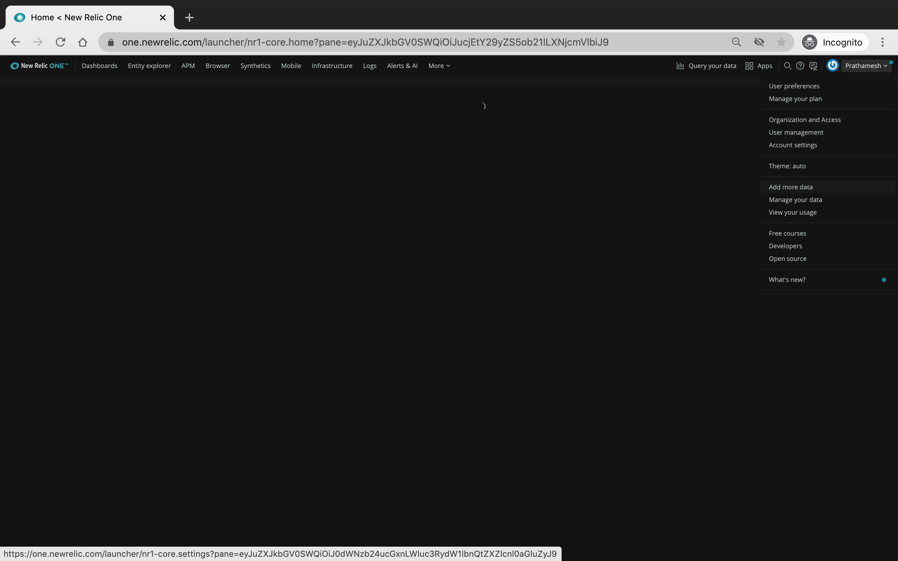
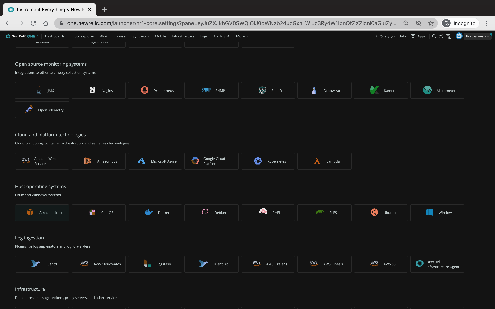
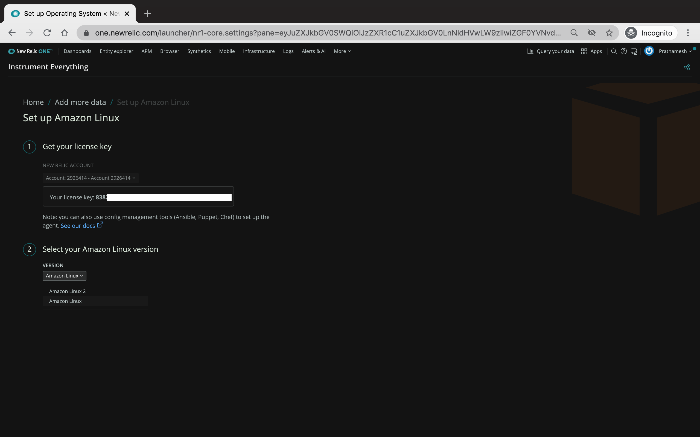
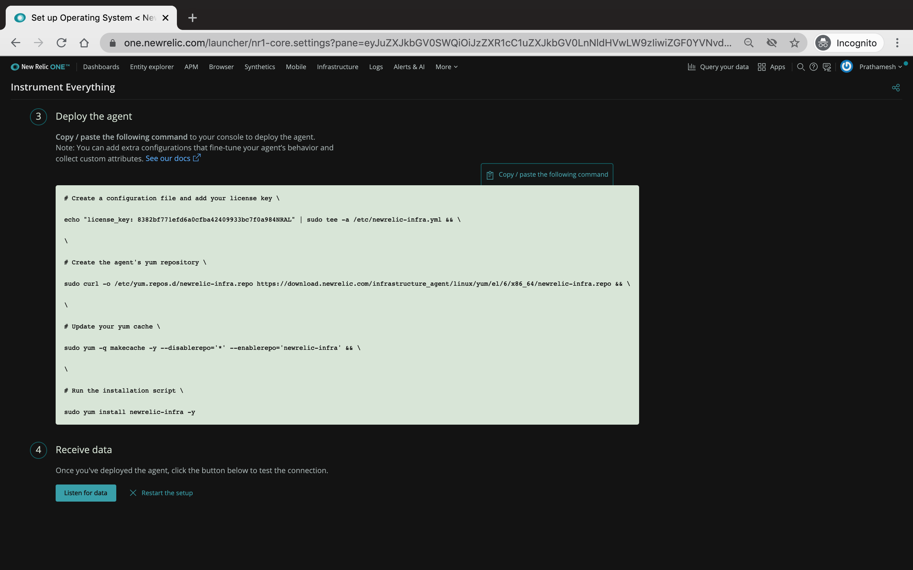
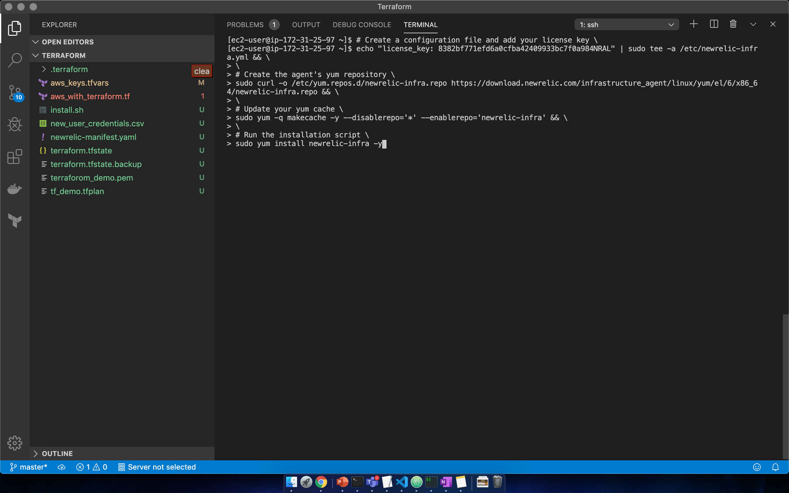
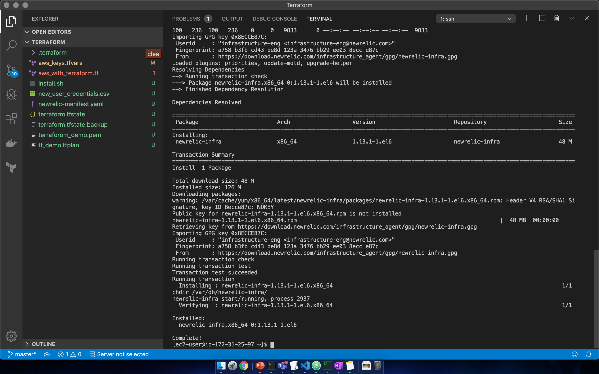
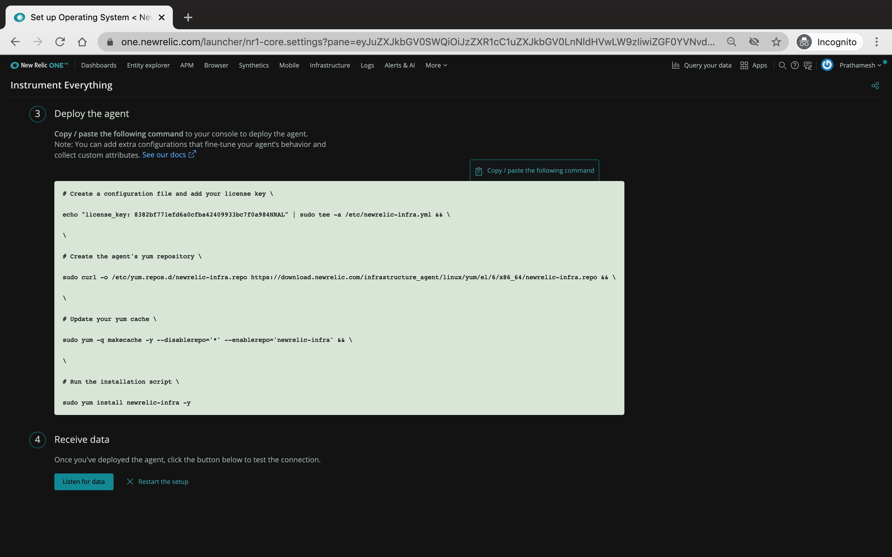
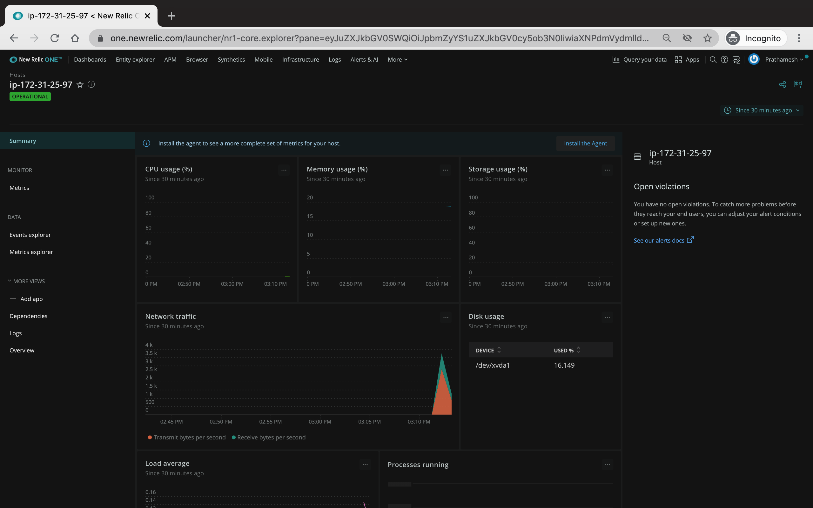
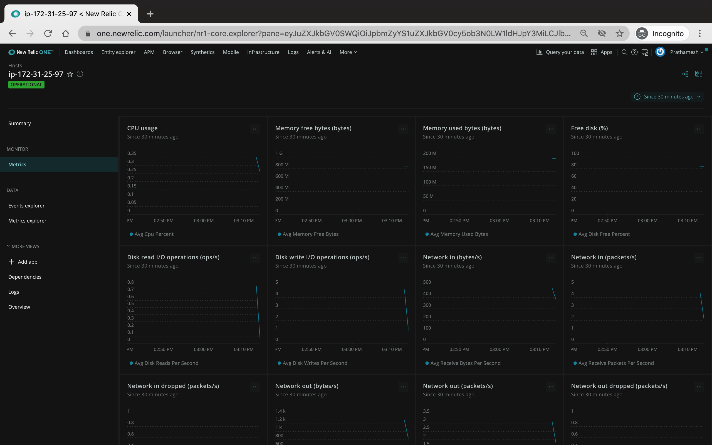

# New Relic Infrastructure hands-on 

> The EC2 related details will be shared in chat, check for yours if you do not have one.

### Setting up Infra agent on a AWS Linux platform

#### NR infra agent setup
Go-to the [New Relic](https://one.newrelic.com/launcher/) main page, login. Once logged in - go to add more data - 



#### Select the OS platform
From the wide range of connections available, scroll down to Host OS systems and select AWS linux


#### Verify your NR account
If you have multiple accounts, select the one you intend to monitor the infra in:


#### Select the right OS version and generate the command
Scroll down and select the Amazon Linux and not Amazon Linux 2 and then generate agent installation script and copy it


#### Execute the command
Paste the script onto your ec2 machine
EC2 Login steps: 
1. Ask for the ssh_key file if you do not already have one.
2. Change the permission of the file that to `chmod 400 <file_name>`
3. Once you have the file, ssh from your terminal using the following command:
```
ssh -i <ssh_key_file.pem> ec2-user@<node_public_ip or fqdn>
```

5. Now that you've logged into the node, paste the command from New Relic that you had copied


6. Your installation should look like this


#### Listen to your data in NR 
Once your New Relic Infra agent is installed, its time to populate the data in NR
Go back to browser where you have your NR agent setup screen open and click on __Listen to Data__


#### Have fun
It may take a while for it to load data but once it has loaded you should see your infrstructure overview and metric dashboard loaded


