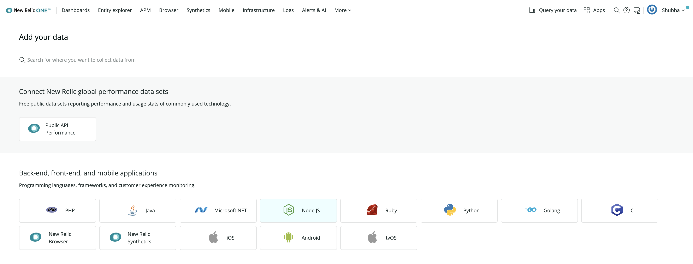
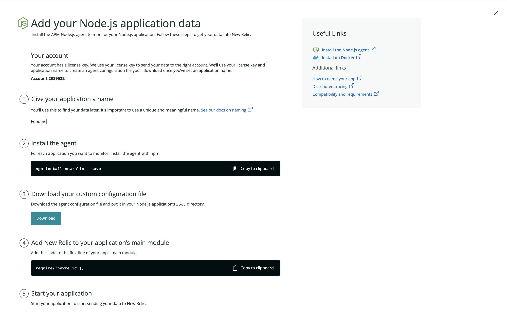
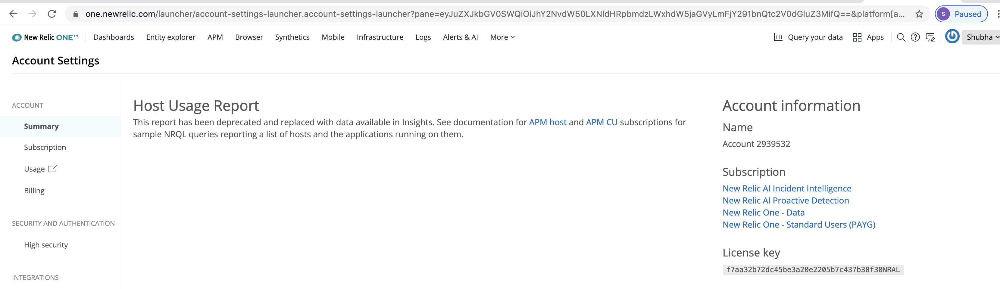
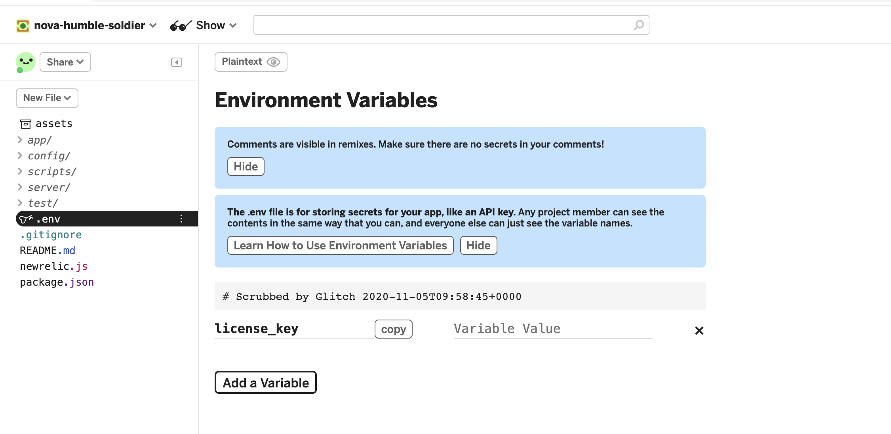
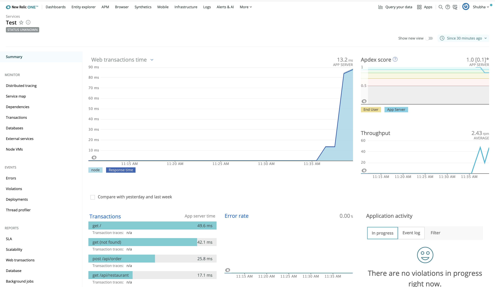

# NewrelicAPM

Navigate to your newrelic account -> add more data -> click on nodejs ->select your account->continue

Give your appname (should match the one in  newrelic.js  and package.json file), download configuration file and say see your data.

Create an account at glitch.com

1)To get licensce key, navigate to one.newrelic.com ->click on your account ->click on account settings

Edit .env file to contain your newrelic license key

2)Go to your glitch account ->click on env file -> Remix to edit -> Add your license key in variable value block

Generate traffic for the app and we can monitor all backend aspects of the application
