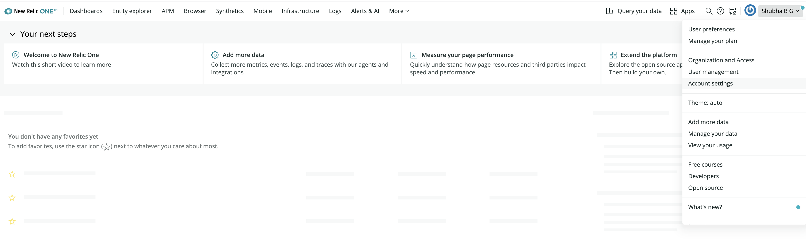
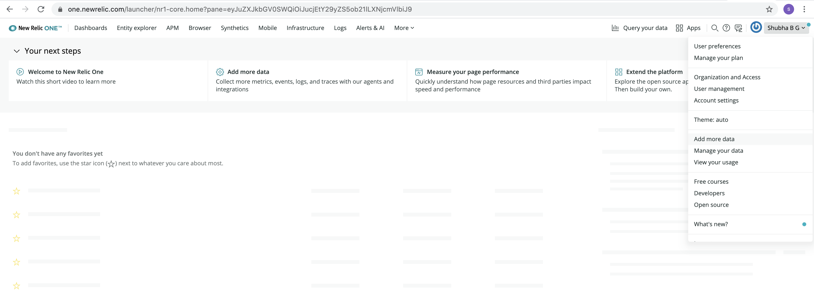

# NewrelicAPM

Create an account at glitch.com

Edit .env file to contain your newrelic license key

1)To get licensce key, navigate to one.newrelic.com ->click on your account ->click on account settings

2)Go to your glitch account ->click on env file -> Remix to edit -> Add your license key in variable value block

Set the name of the application in newrelic.js  and package.json file

*To have the APM setup in NR*

Navigate to your newrelic account -> add more data -> click on nodejs ->select your account->continue

Give your appname (should match the one in  newrelic.js  and package.json file), download configuration file and say see your data.
