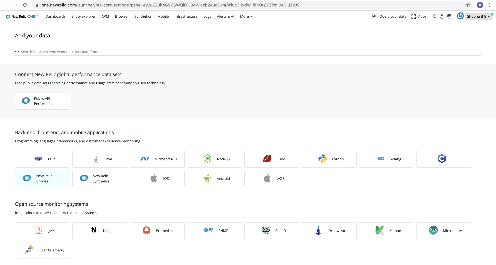
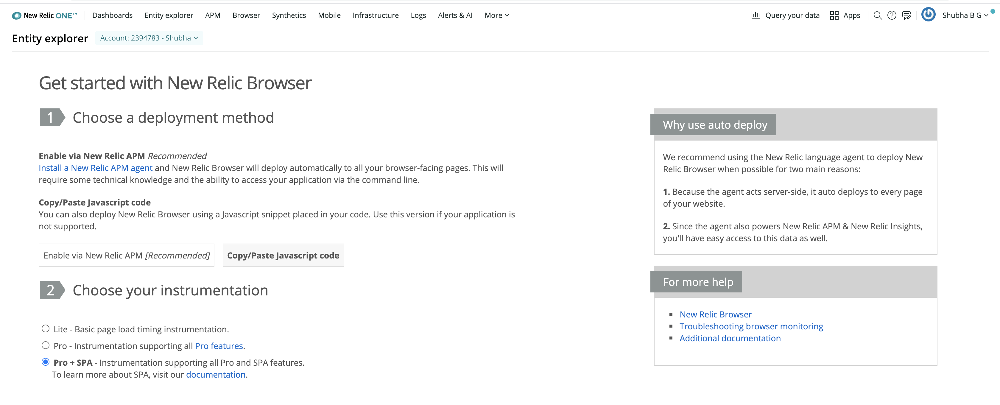
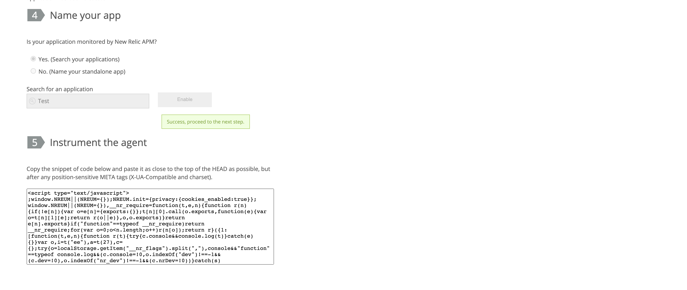
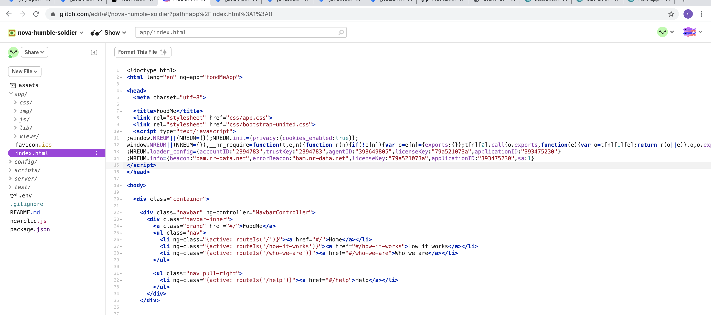

1)In add more data of your newrelic account select newrelic browser,select your account ,choose copy/paste javascript code and copy the browser agent
code snippet

2)Paste the snippet into apps "index.html" file. (inside<head> </head>)

3)In "Name your app section" select yes(since we have APM monitoring enabled) and search for the application Name

4)Deploy it and you can see browser agent running for you application
